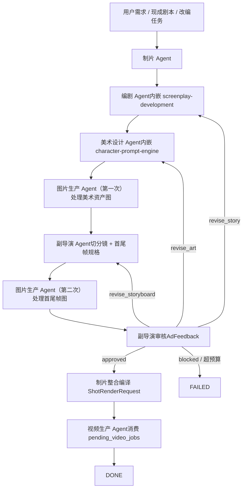

# Slate

Version: `0.3.0`

Slate 是一个**制片驱动的视频前期生产 OpenClaw 插件**。装完以后，你在 OpenClaw 里会多出 6 个协同工作的 agent：制片、编剧、美术设计、副导演、图片生产、视频生产；它们会把一个模糊需求、现成剧本或改编任务，推进到一组结构化的 `ShotRenderRequest`。

它**不调用任何真实图像 / 视频模型**。Slate 只负责前期资料整理、`AssetLibrary` 管理、角色一致性、分镜规格、提示词编译和生产队列组织；真正调用哪个模型，由 OpenClaw 那边注入的 `ModelProfile` 和模型配置决定。

## Slate 是什么

Slate 不是“几个写 prompt 的 skill 打包在一起”，而是一套**可安装到 OpenClaw 的视频前期 agent 插件**。它把 `screenplay-development` 和 `character-prompt-engine` 收编进一条制片驱动的工作流里，最终产出不是散落的 markdown，而是能直接喂给下游视频模型执行层的 `ShotRenderRequest[]`。

对外看，Slate 解决的是“项目前期怎么组织”；对内看，它的中枢是 `AssetLibrary`、`Shot`、`ShotRenderRequest`、`ModelProfile` 和 2 个队列型生产 agent。

## 它解决什么问题

### 问题 A：项目明明有材料，却一直进不了生产

很多项目并不是“没有想法”，而是已经有 brief、梗概、分镜、美术测试图，但它们互相不对齐，最后没有人能把这些材料收束成一份可执行的生产请求。Slate 把这件事拆给 6 个角色：制片负责冻结 brief 和整合，编剧负责故事包，美术设计负责风格与美术生成计划，副导演负责切分镜与首尾帧规格，图片生产 / 视频生产负责消费队列。

换句话说，Slate 解决的是**项目组织问题**，不是单一模型效果问题。

### 问题 B：视频模型听不懂名字

对视频模型来说，`鲁班`、`张果老`、`白驴`、`赵州桥` 这些名字本身没有视觉信息。Slate 会先把这些名字注册进 `AssetLibrary`，再由美术设计和图片生产把它们变成可绑定的 reference image + 描述资产，最后由 `compile_shot` 把“名字”编译成模型能理解的 `ShotRenderRequest`。

所以 Slate 的真正价值，不是“多写几个漂亮 prompt”，而是把**名字 -> 资产 -> 分镜 -> 渲染请求** 这条链做实。

## 核心架构



| 角色 | 主要工作 | 不负责 | 关键输出 |
|---|---|---|---|
| 制片 Agent | 接需求、冻结 brief、建 stub assets、分派、整合、汇总反馈 | 写故事、做美术、跑模型 | `ProjectBrief`、stub `Asset[]`、`ProductionPacket` |
| 编剧 Agent | 故事改编、结构化故事包 | 视觉、镜头 | `StoryPackage` |
| 美术设计 Agent | 风格方向、角色设定、产出美术生成计划（带 prompt） | 真的出图、改故事 | `ArtGenerationPlan`（内含 `ImageJob[]`） |
| 副导演 Agent | 切分镜、运镜/景别/机位、首尾帧规格、审核反馈 | 真的出图、跑视频模型 | `StoryboardPackage`、新的 `ImageJob[]`、`AdFeedback` |
| 图片生产 Agent | 消费 `pending_image_jobs`（资产图 + 首尾帧图） | 改故事、改风格、改分镜 | 回写 `AssetLibrary` 和 `Shot.first/last_frame_ref.image_path` |
| 视频生产 Agent | 消费 `pending_video_jobs`，调视频模型 | 改前面任何东西 | 视频产出路径、执行报告 |

## 数据合同

### `AssetLibrary`

`AssetLibrary` 是 Slate 的中枢，统一管理 5 种资产：

- `character`
- `location`
- `prop`
- `style_pack`
- `camera_pack`

每个 `Asset` 都有 `name / aliases / description / visual_hooks / reference_image_paths / status`，生命周期是 `stub -> generated -> approved`。制片建 stub，美术设计和图片生产把它补成 generated，副导演审核通过后可翻到 approved。

### `Shot` + `ShotRenderRequest`

副导演输出的是结构化 `Shot[]`，里面包含：

- `beat_id`
- `description`
- `involved_asset_ids`
- `camera`
- `first_frame_ref / last_frame_ref`
- `style_pack_id`

制片整合阶段会把它们编译成 `ShotRenderRequest[]`。这个编译过程会做：

- 名字解析与共指消解
- image reference 槽位绑定
- 按 `ModelProfile` 生成目标模型可吃的正负提示词

### `ModelProfile`

`ModelProfile` 不是具体模型 SDK，而是**模型能力描述**。它定义：

- 最长时长
- 最多参考图数量
- 是否支持 role binding
- 需要追加的 negative fragments
- 镜头动词映射
- 支持的画幅

Slate 自带一个 `EXAMPLE_PROFILE` 占位；真实 profile 由 OpenClaw 注入。

## 与 OpenClaw 的关系

Slate 负责的是：

- 前期资料组织
- `AssetLibrary` 管理
- 分镜切分
- 首尾帧规格
- `ShotRenderRequest` 编译
- 图片 / 视频生产队列调度

OpenClaw 负责的是：

- 安装并触发这 3 个 skill
- 注入真正要用的 `ModelProfile`
- 把 `ShotRenderRequest` 送进实际模型配置
- 管理模型 key、限额、provider 适配

所以 Slate 本身**不带任何模型 API key，也不依赖任何模型 SDK**。

## 安装到 OpenClaw

先拉仓库：

```bash
git clone https://github.com/Wei-zuo/Slate.git
```

安装 skill：

```bash
mkdir -p ~/.openclaw/skills
cp -R Slate/skills/screenplay-development ~/.openclaw/skills/
cp -R Slate/skills/character-prompt-engine ~/.openclaw/skills/
cp -R Slate/skills/video-agent-orchestration ~/.openclaw/skills/
```

安装 Python runtime：

```bash
pip install ./Slate/runtime
```

如果你只是想装到当前工作区，也可以：

```bash
mkdir -p ./skills
cp -R Slate/skills/screenplay-development ./skills/
cp -R Slate/skills/character-prompt-engine ./skills/
cp -R Slate/skills/video-agent-orchestration ./skills/
pip install ./Slate/runtime
```

## 三个 skill 各自的作用

### `video-agent-orchestration`

Slate 主控 skill。负责路由入口类型、定义 6 角色顺序、维护 handoff 规则、控制 revision budget，并把终点锁到 `ShotRenderRequest[]`。

### `screenplay-development`

编剧 Agent 的内部能力。负责一句话故事、结构化故事包、beat 设计和 `StoryPackage` 产出；同时负责在 `characters: list[CharacterCard]` 里登记角色，供制片生成 stub assets。

### `character-prompt-engine`

美术设计 Agent 的内部能力。负责把角色 / 场景 / 道具 / style pack 变成可写入 `ImageJob.prompt` 的 prompt block，服务 `ArtGenerationPlan.asset_jobs`。

## Python runtime 简介

| 文件 | 职责 |
|---|---|
| `runtime/video_agents/assets.py` | `Asset` / `AssetLibrary` |
| `runtime/video_agents/schemas.py` | 结构化 schema 合同 |
| `runtime/video_agents/state.py` | LangGraph state + phase + revision budget |
| `runtime/video_agents/services.py` | 6 个 agent 的 Protocol |
| `runtime/video_agents/image_production.py` | 图片生产队列节点 |
| `runtime/video_agents/video_production.py` | 视频生产队列节点 |
| `runtime/video_agents/compile.py` | `Shot -> ShotRenderRequest` |
| `runtime/video_agents/model_profile.py` | `EXAMPLE_PROFILE` |
| `runtime/video_agents/segment.py` | beat-aware 分段 |
| `runtime/video_agents/feedback.py` | 关键词 feedback parser stub |
| `runtime/video_agents/stubs.py` | 最小可跑 stub agents |
| `runtime/video_agents/graph.py` | 六角色 LangGraph |
| `runtime/video_agents/export_schemas.py` | 导出单文件 `schemas.json` |

## Quick start

最小命令跑通赵州桥例子：

```bash
pip install ./runtime
python3 -m runtime.video_agents.export_schemas
python3 examples/zhaozhouqiao-2d-adaptation/scripts/build_demo.py
```

生成物：

- `runtime/video_agents/schemas.json`
- `examples/zhaozhouqiao-2d-adaptation/storyboard.json`
- `examples/zhaozhouqiao-2d-adaptation/shot-render-requests.json`

## 目录结构

```text
docs/
  agent-system-prototype.md
  agent-runtime-architecture.md
  asset-library.md
  shot-compile.md
  production-agents.md
  openclaw-plugin.md
examples/
  zhaozhouqiao-2d-adaptation/
    README.md
    assets/
    art-tests/
    storyboard.json
    shot-render-requests.json
    scripts/
      build_demo.py
runtime/
  README.md
  pyproject.toml
  video_agents/
    __init__.py
    assets.py
    schemas.py
    state.py
    services.py
    image_production.py
    video_production.py
    compile.py
    model_profile.py
    segment.py
    feedback.py
    stubs.py
    graph.py
    export_schemas.py
    schemas.json
skills/
  screenplay-development/
  character-prompt-engine/
  video-agent-orchestration/
tests/
  test_assets.py
  test_compile.py
  test_segment.py
  test_graph_smoke.py
```

## 赵州桥示例

`examples/zhaozhouqiao-2d-adaptation/` 现在同时保留：

- 面向人读的 markdown 前期资料
- 面向程序跑的 `assets/`
- 面向下游模型的 `storyboard.json`
- 用 `compile_all_shots + EXAMPLE_PROFILE` 生成的 `shot-render-requests.json`

这个例子验证的不是“一键出片”，而是：

1. 名字能不能先变成资产
2. 分镜能不能变成结构化 `Shot`
3. `Shot` 能不能稳定编译成模型请求

## Roadmap

`v0.4` 预计做：

- FeedbackParser 上 LLM
- 跨项目 asset 复用
- CLI 包装

## License

本仓库采用 [LICENSE](LICENSE) 中声明的协议。
