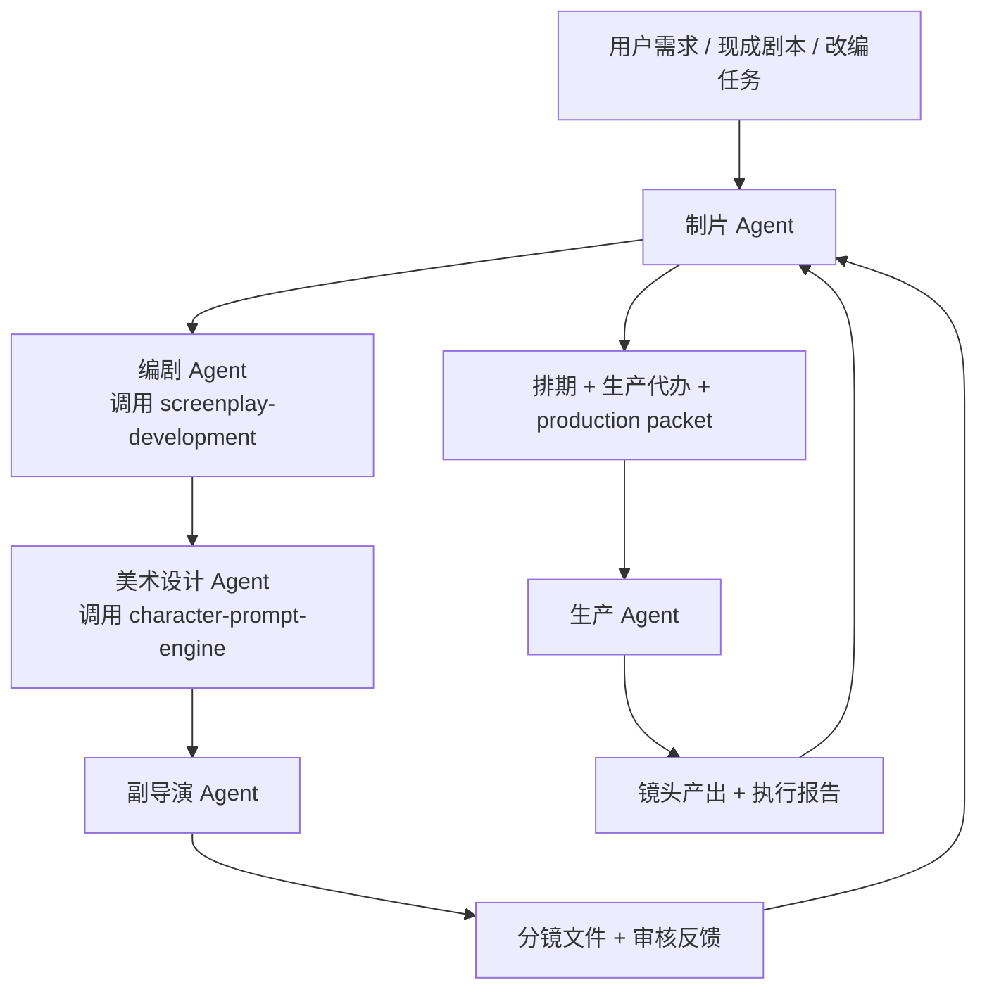

# Slate

## 中文简介

`Slate` 目前开源了三个可直接放进 Codex 的技能：

- `screenplay-development`：把灵感、梗概和草稿打磨成更可拍、更可卖的剧本
- `character-prompt-engine`：把角色设定、服化道、镜头与气质需求压缩成可直接出图的人设/定妆照提示词
- `video-agent-orchestration`：把 brief、现成剧本或改编任务，按制片逻辑逐阶段推进，整理出可交给生产层的 `production packet`

这三个 skill 里，主轴其实是 `video-agent-orchestration`。

前两个不是孤立工具，而是被它吸收到 agent 群里：

- `screenplay-development` 融进 `编剧 Agent`
- `character-prompt-engine` 融进 `美术设计 Agent`

所以如果你想理解 `Slate` 的整体价值，最好的方式不是把它看成 3 个分散技能，而是把它看成 1 套由制片逻辑驱动的视频前期工作流规范。

## 把 Slate 看成一套视频前期工作流规范

原型说明文档见 [docs/agent-system-prototype.md](docs/agent-system-prototype.md)。



> **当前范围说明**：Slate 是一套提示词规范（Codex skill），每个阶段由用户手动调用对应 skill 推进。生产层（生产 Agent → 镜头产出）尚未实现自动对接，`production packet` 是当前流程的交付终点。

### 角色分工

| 角色 | 主要工作 | 不负责 | 关键输出 | 内嵌能力 |
|---|---|---|---|---|
| 制片 Agent | 接需求、分派、排期、整合生产包 | 写故事、做美术、拆镜头、跑模型 | `brief.md`、`adaptation_notes.md`、`schedule.md`、`production_todo.md`、`production_packet.md` | `video-agent-orchestration` |
| 编剧 Agent | 故事改编、创意强化、结构整理 | 具体视觉方案、镜头拆分 | `story_package.md` | `screenplay-development` |
| 美术设计 Agent | 风格方向、角色设定、服化道、风格提示词 | 剧情推进、镜头顺序 | `art_package.md`、`art-tests/*.png` | `character-prompt-engine` |
| 副导演 Agent | 分镜文件、镜头风险判断、审核反馈 | 排期、模型执行 | `storyboard.md`、`ad_feedback.md` | `video-agent-orchestration` |
| 生产 Agent | 调模型、生成镜头、记录执行结果 | 改故事、改风格、改分镜逻辑 | `shots/*`、执行报告 | 生产层自定义工具链 |

### `video-agent-orchestration` 在里面做什么

它是一套提示词规范，定义了角色分工、阶段顺序、交接文件和阶段门，让用户在 Codex 中手动按顺序调用各 skill 时，每一步都有明确的输入要求和输出标准。

它主要约定 5 件事：

1. 定义入口：这是 `brief`、`现成剧本`、`改编任务` 还是 `救火重组`
2. 定义顺序：先编剧，再美术，再副导演，再回到制片整合
3. 定义交接：每一阶段必须交什么文件，谁有权打回上一阶段
4. 定义阶段门：生产包没完整之前，`生产 Agent` 不开工
5. 定义最终交付：把零散剧本、美术、分镜资料收束成 `production packet`

换句话说，它解决的不是"某一步生成质量不够高"，而是"项目明明有很多材料，却一直进不了生产"。

## 三个 Skill 各自怎么用

### `screenplay-development`

- 用在 `编剧 Agent`
- 处理 `spark`、`premise`、`draft`、`industrialize`
- 适合先把故事做成能拍、能卖、能继续开发的一版

### `character-prompt-engine`

- 用在 `美术设计 Agent`
- 把角色身份锚点、服化道、材质、镜头和气质压成 prompt
- 适合角色定妆照、人设图、风格测试图、一致性测试图

### `video-agent-orchestration`

- 用在 `制片 Agent` 主导的整条链
- 负责调用前两个 skill，并定义分工、交接和文件体系
- 适合 `已有剧本改编`、`IP 前期策划`、`民间故事动画化`、`production packet` 整理

## 当前收录

- `skills/screenplay-development/`
  - 一句话故事闸门
  - `Save the Cat / 救猫咪` 结构压力测试
  - 面向短片、长片、剧集、微短剧开发
- `skills/character-prompt-engine/`
  - 角色设定、人设图、定妆照和视觉变体
  - 默认输出可直接复制到图像模型的 prompt
  - 强调结构锚点与跨图一致性
- `skills/video-agent-orchestration/`
  - 制片驱动的视频 agent 流程
  - 产出 `brief`、`story package`、`art package`、`storyboard`、`AD feedback`、`schedule`、`production todo`、`production packet`
  - 默认把前两个 skill 融入编剧和美术阶段

## 安装方式

将本仓库里的 skill 目录复制到本地 Codex skills 目录，例如：

```bash
mkdir -p "${CODEX_HOME:-$HOME/.codex}/skills"
cp -R skills/screenplay-development "${CODEX_HOME:-$HOME/.codex}/skills/"
cp -R skills/character-prompt-engine "${CODEX_HOME:-$HOME/.codex}/skills/"
cp -R skills/video-agent-orchestration "${CODEX_HOME:-$HOME/.codex}/skills/"
```

安装后，直接在 Codex 中调用：

```text
Use $screenplay-development 把这个灵感先打磨成 3 条一句话故事，等我选中再继续扩写。
```

```text
Use $character-prompt-engine 把这个角色设定整理成一条可直接出图的人设提示词，只输出提示词本身。
```

```text
Use $video-agent-orchestration 把这个剧本改编成 2D 动画前期生产包，并在编剧阶段调用 $screenplay-development、在美术阶段调用 $character-prompt-engine。
```

## OpenClaw 拉取

仓库拉取链接：

```text
https://github.com/Wei-zuo/Slate.git
```

如果你使用 OpenClaw，可以把这三个 skill 拉到共享 skills 目录：

```bash
git clone https://github.com/Wei-zuo/Slate.git
mkdir -p ~/.openclaw/skills
cp -R Slate/skills/character-prompt-engine ~/.openclaw/skills/
cp -R Slate/skills/screenplay-development ~/.openclaw/skills/
cp -R Slate/skills/video-agent-orchestration ~/.openclaw/skills/
```

如果你只想装到当前 workspace：

```bash
git clone https://github.com/Wei-zuo/Slate.git
mkdir -p ./skills
cp -R Slate/skills/character-prompt-engine ./skills/
cp -R Slate/skills/screenplay-development ./skills/
cp -R Slate/skills/video-agent-orchestration ./skills/
```

重开一个新的 OpenClaw session 后，skill 就会被加载。

## 目录结构

```text
docs/
  agent-system-prototype.md
skills/
  character-prompt-engine/
    SKILL.md
    agents/
      openai.yaml
  screenplay-development/
    SKILL.md
    agents/
      openai.yaml
    references/
      commercial-evaluation.md
      development-frameworks.md
      logline-and-save-the-cat.md
  video-agent-orchestration/
    SKILL.md
    agents/
      openai.yaml
    references/
      handoff-rules.md
      pipeline-files.md
examples/
  zhaozhouqiao-2d-adaptation/
    README.md
    art-tests/
      luban-test.png
      zhangguolao-test.png
      chaiwangye-test.png
      bridge-test.png
```

## 示例案例：赵州桥 2D 动画改编

完整案例见 [examples/zhaozhouqiao-2d-adaptation/README.md](examples/zhaozhouqiao-2d-adaptation/README.md)。

这个案例不是为了证明"模型能不能一键出片"，而是为了验证这套 agent 群能不能把一个已有剧本，稳定推进到 `production packet`。

案例输入：

- 源材料：`赵州桥故事剧本`
- 目标形式：`2D 国风手绘动画`
- 流程范围：`改编 -> 故事包 -> 美术包 -> 分镜 -> 审核反馈 -> 制片整合`

### 这个案例里，谁做了什么

| 角色 | 做了什么 | 输出了什么 |
|---|---|---|
| 制片 Agent | 接剧本、冻结方向、判断本轮做到前期整合 | [brief.md](examples/zhaozhouqiao-2d-adaptation/brief.md)、[adaptation_notes.md](examples/zhaozhouqiao-2d-adaptation/adaptation_notes.md)、[producer_log.md](examples/zhaozhouqiao-2d-adaptation/producer_log.md) |
| 编剧 Agent | 保留传奇核心，把原稿改成更适合动画生产的故事包 | [story_package.md](examples/zhaozhouqiao-2d-adaptation/story_package.md) |
| 美术设计 Agent | 锁定鲁班、张果老、柴王爷、白驴和桥体风格，产出测试图 | [art_package.md](examples/zhaozhouqiao-2d-adaptation/art_package.md)、`art-tests/*.png` |
| 副导演 Agent | 把故事和美术拆成 `12` 镜头，标风险镜头，提出补图需求 | [storyboard.md](examples/zhaozhouqiao-2d-adaptation/storyboard.md)、[ad_feedback.md](examples/zhaozhouqiao-2d-adaptation/ad_feedback.md) |
| 制片整合 | 汇总上游材料，形成排期、代办和最终生产包 | [schedule.md](examples/zhaozhouqiao-2d-adaptation/schedule.md)、[production_todo.md](examples/zhaozhouqiao-2d-adaptation/production_todo.md)、[production_packet.md](examples/zhaozhouqiao-2d-adaptation/production_packet.md) |

### 重点成果

- 编剧阶段把原故事收束成 `180 秒 / 12 镜头` 的动画叙事结构
- 美术阶段明确 `2D 国风手绘动画`，避免漂成泛仙侠或写实 3D
- 副导演阶段把 `09`、`10` 标成高风险镜头，提前暴露制作问题
- 制片阶段把故事包、美术包、分镜和反馈整合成可交给生产层的 `production packet`

### 案例预览

鲁班角色测试：


赵州桥桥体测试：


如果你想看完整材料，优先从这几份开始：

- [story_package.md](examples/zhaozhouqiao-2d-adaptation/story_package.md)
- [art_package.md](examples/zhaozhouqiao-2d-adaptation/art_package.md)
- [storyboard.md](examples/zhaozhouqiao-2d-adaptation/storyboard.md)
- [production_packet.md](examples/zhaozhouqiao-2d-adaptation/production_packet.md)

## License

MIT
