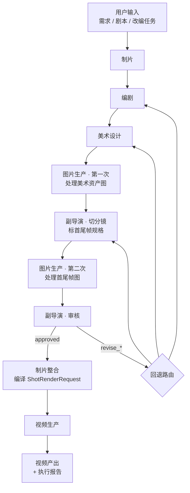
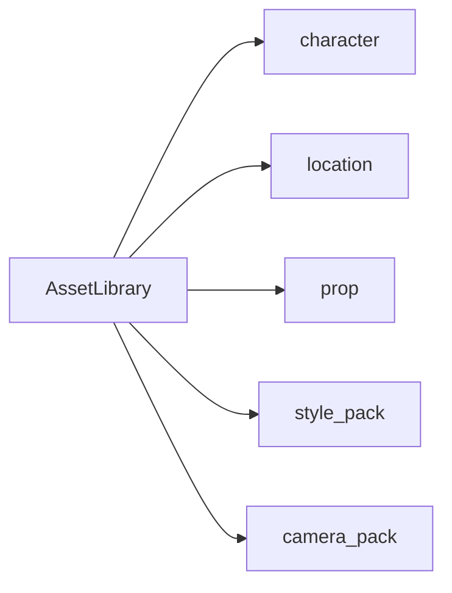
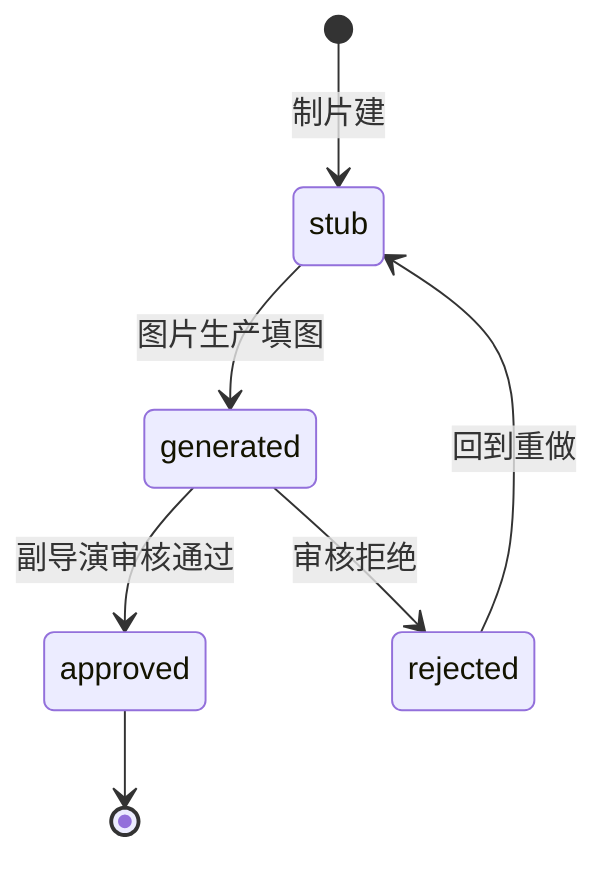
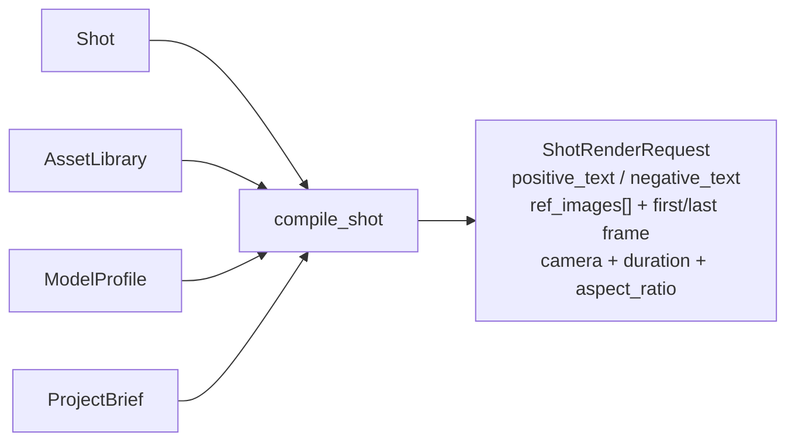

# Slate

Version: `0.3.0`

Slate 是一个**制片驱动的视频前期生产插件**，为 OpenClaw 而写。

装完之后你会多出 6 个协同工作的 agent——**制片 / 编剧 / 美术设计 / 副导演 / 图片生产 / 视频生产**。它们的共同终点是一组结构化的 `ShotRenderRequest`，可以直接喂给任何视频模型执行层。

**Slate 不调用任何图像 / 视频模型。** 模型调用由 OpenClaw 那边配置，Slate 只负责前期组织。

---

## 核心判断

项目做不出来很少是因为"单步生成不够好"，更多是"前期材料永远整不齐"，加上"视频模型压根听不懂`鲁班`、`张果老`这些名字"。

所以 Slate 不在写漂亮 prompt 上发力，它只做一件事：

> 把 **名字 → 资产 → 分镜 → 渲染请求** 这条链做实。

---

## 一张图看懂 Slate 在做什么



图片生产是**队列型 agent**，在图里出现两次——一次消费美术资产图，一次消费首尾帧图。

---

## 六个 Agent 各自的输入 / 工作 / 输出

| Agent | 输入 | 工作 | 输出 |
|---|---|---|---|
| **制片** | 用户原始输入 / 副导演反馈 | 冻结 brief、建 stub assets、分派、整合、控 revision budget | `ProjectBrief` + stub `Asset[]`，最终 `ProductionPacket` |
| **编剧** | `ProjectBrief` | 故事改编、结构化、登记角色卡 | `StoryPackage`（logline / scenes / beats / `CharacterCard[]`）|
| **美术设计** | `ProjectBrief` + `StoryPackage` + `AssetLibrary` | 定风格、为 character / location / prop / style_pack 写 prompt | `ArtGenerationPlan`（含 `ImageJob[]`）|
| **图片生产** | `pending_image_jobs`（资产图 + 首尾帧图混队列）| 调下游图模型、回写 | `Asset.reference_image_paths` 或 `Shot.first/last_frame_ref.image_path` |
| **副导演** | `StoryPackage` + generated `AssetLibrary` | 切分镜、标运镜 / 景别 / 机位、指定首尾帧规格、审核 | `StoryboardPackage`（含 `Shot[]`）+ 新 `ImageJob[]` + `AdFeedback` |
| **视频生产** | `pending_video_jobs`（含 `ShotRenderRequest`） | 调下游视频模型 | 视频文件路径 + 执行报告 |

---

## 三个核心数据结构

Slate 的所有状态都压在三件东西上：`AssetLibrary` / `Shot → ShotRenderRequest` / `ModelProfile`。

### 1. AssetLibrary — 项目资产中枢

五种资产类型，统一结构：



每个 `Asset` 包含：`name / aliases / description / visual_hooks / reference_image_paths / status`。

**实际产出长这样**（来自 `examples/zhaozhouqiao-2d-adaptation/`）：

<table>
<tr>
<td align="center">
<br/>
<sub><b>鲁班</b><br/><code>character</code></sub>
</td>
<td align="center">
<br/>
<sub><b>张果老</b><br/><code>character</code></sub>
</td>
<td align="center">
<br/>
<sub><b>柴王爷</b><br/><code>character</code></sub>
</td>
<td align="center">
<br/>
<sub><b>赵州桥</b><br/><code>location</code></sub>
</td>
</tr>
</table>

这四张图不是最终镜头，而是存进 `AssetLibrary` 里的**身份锚点**——后面 `compile_shot` 每次遇到`鲁班`、`张果老`、`赵州桥`这些名字，会按 `ModelProfile.max_ref_images` 槽位能力把它们注入到视频模型的参考图里，替代模型原本听不懂的文字名。

**Asset 生命周期：**



磁盘布局 `<project>/assets/<asset_type>/<asset_id>/{meta.yaml, *.png}`——人能看、能 git，没有数据库依赖。

### 2. Shot → ShotRenderRequest — 分镜的编译

副导演产出机器可读的 `Shot`：

```
Shot {
  shot_id, beat_id, duration_seconds,
  description,                  // 自然语言
  involved_asset_ids,           // 指向 AssetLibrary
  camera { movement, shot_size, position, speed },
  first_frame_ref, last_frame_ref,
  style_pack_id, risk_level
}
```

`compile_shot` 把它编译成下游模型能吃的 `ShotRenderRequest`：



编译器只做三件事：

1. **名字解析 + 代词回指**——`鲁班看向他`里的`他`绑到最近提到的角色 asset
2. **参考图槽位绑定**——按 `ModelProfile.max_ref_images` 决定哪些 asset 进 ref_images、哪些降级为文字描述
3. **按模型方言渲染**——`camera_verb_map` 翻译运镜术语，附加 `required_negative_fragments`（比如 `no subtitles`）

### 3. ModelProfile — 模型能力描述（不含具体实现）

Slate 不知道你用什么视频模型，但需要知道它的边界：

```
ModelProfile {
  max_seconds,                   // 单次最长时长
  max_ref_images,                // 能吃几张参考图
  role_binding_supported,        // 多参考图是否区分角色
  required_negative_fragments,   // 强制负面提示
  camera_verb_map,               // 运镜术语翻译表
  preferred_language,
  aspect_ratios_supported
}
```

Slate 自带一个 `EXAMPLE_PROFILE` 占位；**真实 profile 由 OpenClaw 注入**。

---

## 与 OpenClaw 的分工

| Slate 负责 | OpenClaw 负责 |
|---|---|
| 前期资料组织、`AssetLibrary` 管理 | 安装并触发 skill |
| 分镜切分、首尾帧规格 | 注入 `ModelProfile` |
| `ShotRenderRequest` 编译 | 把请求送进真实模型 |
| 图片 / 视频生产队列调度 | 管理 API key、限额、provider 适配 |

Slate 本身**不带任何模型 API key，也不依赖任何模型 SDK**。

---

## 安装

```bash
git clone https://github.com/Wei-zuo/Slate.git

# 安装 skill
mkdir -p ~/.openclaw/skills
cp -R Slate/skills/* ~/.openclaw/skills/

# 安装 Python runtime
pip install ./Slate/runtime
```

---

## Quick start

```bash
python -m runtime.video_agents.export_schemas
python examples/zhaozhouqiao-2d-adaptation/scripts/build_demo.py
```

生成物：

- `runtime/video_agents/schemas.json`
- `examples/zhaozhouqiao-2d-adaptation/storyboard.json`
- `examples/zhaozhouqiao-2d-adaptation/shot-render-requests.json`

---

## 示例：赵州桥 2D 动画改编

`examples/zhaozhouqiao-2d-adaptation/` 是一个从"现成剧本"推到 `shot-render-requests.json` 的完整样例，同时保留人读的 markdown 和机器吃的 JSON。

它验证的不是"一键出片"，而是：

1. 名字（鲁班、张果老）能否先变成资产
2. 分镜能否变成结构化 `Shot`
3. `Shot` 能否稳定编译成下游模型请求

---

## 三个 Skill

- `video-agent-orchestration` — Slate 主控，六角色流程与 revision 预算
- `screenplay-development` — 编剧 Agent 内部能力
- `character-prompt-engine` — 美术设计 Agent 内部能力

详细使用见 `docs/openclaw-plugin.md`。

---

## Roadmap

`v0.4` 计划：FeedbackParser 上 LLM · 跨项目 asset 复用 · CLI 包装。

---

## License

见 [LICENSE](LICENSE)。
