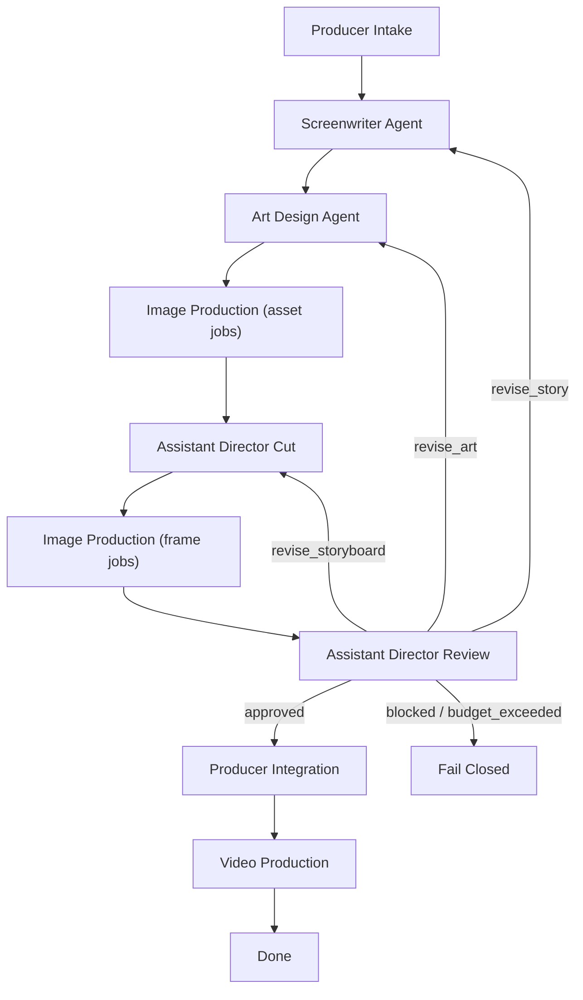

# Agent Runtime Architecture

这份文档回答一个核心问题：

Slate v0.3 怎么从“3 个 skill + 手动切换”升级成“可安装到 OpenClaw 的六角色 runtime”。

## 先说结论

Slate 的 runtime 不是聊天式 multi-agent，而是**制片驱动的状态图**。

核心选择：

- 顶层编排：`LangGraph`
- 结构化产出：`Pydantic`
- 模型能力描述：`ModelProfile`
- 中枢资产层：`AssetLibrary`
- 执行层：`pending_image_jobs` / `pending_video_jobs`

## 真 Agent 版流程图

## 为什么要有 AssetLibrary

Slate 解决的一个根问题是：名字本身不是视觉资产。

`鲁班`、`张果老`、`赵州桥` 这些词，模型不天然知道它们长什么样。于是 runtime 先把它们编成 `Asset`，由美术设计 / 图片生产补齐参考图，再由 `compile_shot` 把镜头里的名字解析成：

- reference image
- textual description
- style pack
- camera spec

没有 `AssetLibrary`，后面的 `ShotRenderRequest` 就会一直漂在纯文本层。

## 结构化产出

### 1. Producer

- `ProjectBrief`
- stub `Asset[]`
- `ProductionPacket`

### 2. Screenwriter

- `StoryPackage`
  - `characters: list[CharacterCard]`
  - `scenes: list[SceneSpec]`
  - `beats: list[StoryBeat]`

### 3. Art Design

- `ArtGenerationPlan`
  - `style_pack_id`
  - `asset_jobs: list[ImageJob]`

### 4. Assistant Director

- `StoryboardPackage`
  - `shots: list[Shot]`
  - `first_test_shot_ids`
- `AdFeedback`

### 5. Production

- `ShotRenderRequest`
- `VideoJob`

## 新 schema 概览

### `Asset`

核心字段：

- `asset_id`
- `asset_type`
- `name`
- `aliases`
- `description`
- `visual_hooks`
- `reference_image_paths`
- `status`

### `Shot`

核心字段：

- `shot_id`
- `beat_id`
- `description`
- `involved_asset_ids`
- `camera`
- `first_frame_ref`
- `last_frame_ref`
- `style_pack_id`

### `ShotRenderRequest`

核心字段：

- `positive_text`
- `negative_text`
- `ref_images`
- `camera`
- `duration_seconds`
- `aspect_ratio`

### `ModelProfile`

核心字段：

- `max_seconds`
- `max_ref_images`
- `role_binding_supported`
- `required_negative_fragments`
- `camera_verb_map`
- `aspect_ratios_supported`

## image / video 队列

### 图片生产

图片生产节点消费 `pending_image_jobs`。

工作分两次：

1. 美术资产图
2. 分镜首尾帧图

成功时：

- `asset_image` 回写到 `Asset.reference_image_paths`
- `first_frame / last_frame` 回写到 `Shot.first_frame_ref.image_path` / `Shot.last_frame_ref.image_path`

失败时：

- 单 job 最多重试到 `retry_count >= 2`
- 失败 2 次后记为 blocking issue
- 资产图失败默认走 `revise_art`
- 首尾帧失败默认走 `revise_storyboard`

### 视频生产

视频生产节点消费 `pending_video_jobs`。

- 每个 job 最多重试 1 次
- 全部 `done` -> `DONE`
- 任一 `failed` -> `FAILED`

## `compile_shot`

`compile_shot` 做三步：

1. 名字解析与共指消解
2. 参考图槽位绑定
3. 按 `ModelProfile` 渲染成 `ShotRenderRequest`

这层是 Slate 和 OpenClaw 模型执行层的真正接口。

## 回退机制

副导演审核不是自由评论，而是结构化 `AdFeedback`：

- `approved`
- `revise_story`
- `revise_art`
- `revise_storyboard`
- `blocked`

revision budget：

- 编剧 2
- 美术 2
- 副导演 1
- 总 5

另外补一条：

- `image_production` 失败 2 次，作为 blocking issue 走 `revise_art` 或 `revise_storyboard` 回退

## 代码落点

- `runtime/video_agents/assets.py`
- `runtime/video_agents/schemas.py`
- `runtime/video_agents/state.py`
- `runtime/video_agents/services.py`
- `runtime/video_agents/image_production.py`
- `runtime/video_agents/video_production.py`
- `runtime/video_agents/compile.py`
- `runtime/video_agents/model_profile.py`
- `runtime/video_agents/segment.py`
- `runtime/video_agents/feedback.py`
- `runtime/video_agents/stubs.py`
- `runtime/video_agents/graph.py`
- `runtime/video_agents/export_schemas.py`
