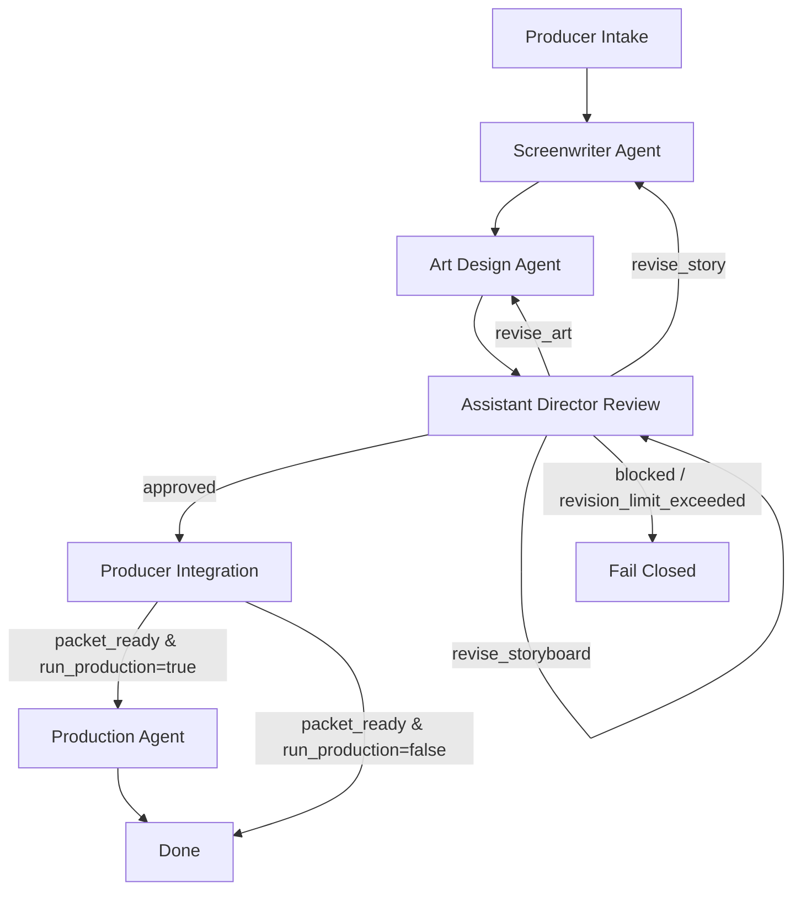

# Agent Runtime Architecture

这份文档回答一个核心问题：

`Slate` 里的五个角色，怎么从“提示词模板”升级成“真 Agent”。

## 先说结论

如果目标是把 `制片 -> 编剧 -> 美术设计 -> 副导演 -> 生产` 做成一条真的可执行流水线，第一层不能只靠 skill 文档切换。

至少要补三层：

1. `编排框架`：把角色链变成有状态的图
2. `结构化输出`：把每阶段产出变成机器可读对象
3. `状态机 + 回退`：把审核打回和停止条件写死

在这个仓库里，推荐做法是：

- 顶层编排：`LangGraph`
- 结构化产出：`Pydantic + JSON Schema`
- 模型执行层：可以接 `OpenAI Structured Outputs`，也可以在单节点里嵌 `OpenAI Agents SDK`

## 为什么顶层选 LangGraph

这套场景的关键不是“多 agent 会不会聊天”，而是：

- 能不能把流程固定成状态图
- 能不能保存中间状态
- 能不能在副导演打回时只重跑某一段
- 能不能限制 revision 次数，避免无限循环

这类要求更像 `stateful workflow`，不是自由对话式 handoff。

`LangGraph` 更适合做顶层，原因是：

- 它本身就是图式编排
- 节点和边是显式的
- 适合长流程、可恢复执行和人工介入
- 很容易把 `审核通过 / 打回编剧 / 打回美术 / 失败终止` 写成明确路由

### 其他方案在这套场景里的位置

`CrewAI`

- 更适合快速搭 `crew + task` 风格流程
- 上手更快
- 但如果你要严控状态、回退边和终止条件，通常还是要自己补很多约束

`AutoGen`

- 适合多 agent 对话、群聊协作、复杂代理互动
- 但对这种“制片驱动、阶段清晰、可回退”的生产图来说，不一定是最克制的第一选择

`OpenAI Agents SDK`

- 很适合做单节点里的专业 agent
- 也适合 handoff、guardrail、tool use
- 但仓库这一层更需要“顶层状态图”，所以更适合作为 `节点执行层`，而不是整个流程的唯一骨架

换句话说：

- `LangGraph` 负责总图
- `OpenAI Structured Outputs / Agents SDK` 负责节点内的结构化生成

## 真 Agent 版流程图



这个图和之前最大区别在于：

- 回退边是显式的
- 终止边是显式的
- 不再靠人工 `Use $xxx` 切换角色

## 结构化产出，不再只靠 Markdown

第二层关键变化是：每个角色不只输出一份文档，还要输出一份机器可读对象。

例如：

### `ProjectBrief`

- `project_id`
- `route`
- `title`
- `goal`
- `format`
- `target_duration_seconds`
- `required_elements`
- `forbidden_drift`

### `StoryPackage`

- `logline`
- `characters`
- `scenes`
- `beats`
- `total_shots`
- `narration_style`

### `ArtPackage`

- `character_anchors`
- `environment_constraints`
- `palette`
- `prompt_blocks`

### `StoryboardPackage`

- `shots`
- `total_duration_seconds`
- `high_risk_shots`
- `first_test_shots`

### `AdFeedback`

- `decision`
- `blocking_issues`
- `revision_request`

### `ProductionPacket`

- `brief`
- `story`
- `art`
- `storyboard`
- `locked_constraints`
- `todo_items`

这些对象的目标不是替代 markdown，而是让 markdown 变成“给人看”，JSON/Pydantic 变成“给下游 agent 和程序消费”。

## 回退机制怎么设计

副导演不是简单写一句“这里不行”，而是必须输出结构化反馈：

```json
{
  "decision": "revise_art",
  "blocking_issues": [
    "桥体结构没有稳定到可重复出镜",
    "张果老与白驴比例关系在关键镜头不一致"
  ],
  "revision_request": {
    "target": "art_design",
    "requested_changes": [
      "补桥体结构图",
      "补角色比例锚点"
    ],
    "retry_budget": 2
  }
}
```

这会触发：

- 路由到 `art_design`
- 对应 revision 计数加一
- 超过预算后直接失败，不再循环

## 终止条件必须写死

没有终止条件的 agent 图，迟早会变成无限打回。

默认建议：

| 回退目标 | 默认上限 | 触发失败条件 |
|---|---|---|
| 编剧 | 2 次 | 结构仍不清晰，或高风险镜头无法通过故事层修复 |
| 美术 | 2 次 | 角色/桥体/风格锚点仍无法稳定 |
| 副导演 | 1 次 | 仍然无法形成可执行镜头单 |
| 总 revision | 5 次 | 项目处于反复拉扯，先停机再人工决策 |

## 这套骨架在仓库里怎么落

代码骨架放在：

- `runtime/video_agents/schemas.py`
- `runtime/video_agents/state.py`
- `runtime/video_agents/services.py`
- `runtime/video_agents/graph.py`
- `runtime/video_agents/export_schemas.py`

对应职责：

- `schemas.py`：定义全部 Pydantic 输出对象
- `state.py`：定义图状态、阶段枚举、revision 预算
- `services.py`：定义每个 agent 节点的执行接口
- `graph.py`：定义 LangGraph 状态图和回退路由
- `export_schemas.py`：把 Pydantic 模型导出成 JSON Schema

## 这层完成后，仓库语义会变化

原来：

- `screenplay-development`
- `character-prompt-engine`
- `video-agent-orchestration`

更像是 3 个可手动调用的 skill。

升级后：

- `video-agent-orchestration` 变成顶层 runtime 规范
- `screenplay-development` 变成 `编剧 Agent` 的内部能力
- `character-prompt-engine` 变成 `美术设计 Agent` 的内部能力

这时候仓库就不再只是“提示词集”，而是“有状态的前期生产 agent 系统”。

## 官方参考

- [LangGraph docs](https://docs.langchain.com/oss/python/langgraph/overview)
- [LangGraph persistence](https://docs.langchain.com/oss/python/langgraph/persistence)
- [OpenAI Agents SDK](https://openai.github.io/openai-agents-python/)
- [OpenAI Structured Outputs](https://platform.openai.com/docs/guides/structured-outputs)
