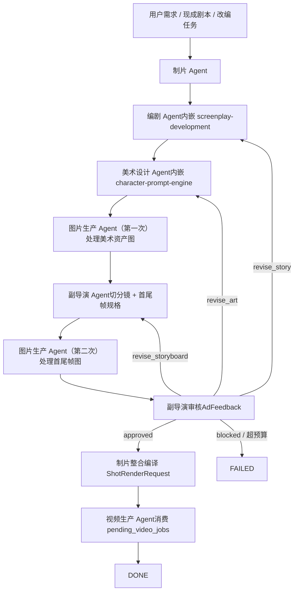

# Agent System Prototype

这份文档给出 Slate v0.3 的六角色原型结构，方便在仓库外引用。

如果你关心 runtime 怎么实现，继续看 [agent-runtime-architecture.md](agent-runtime-architecture.md)。

## 六角色

| 角色 | 负责 | 不负责 |
|---|---|---|
| 制片 | 接需求、冻结 brief、建 stub assets、整合 packet | 写故事、做美术、出图、跑视频模型 |
| 编剧 | 故事改编、结构化故事包 | 美术、镜头、跑模型 |
| 美术设计 | 角色 / 场景 / 道具 / style pack 方案，写 `ImageJob.prompt` | 真正出图、改故事 |
| 图片生产 | 消费 `pending_image_jobs`，回写资产图和首尾帧图 | 改故事、改风格、改镜头 |
| 副导演 | 切分镜、首尾帧规格、审核反馈 | 真正出图、跑视频模型 |
| 视频生产 | 消费 `pending_video_jobs`，调视频模型 | 改前面任何东西 |

## 流程

## 能力映射

| 外部能力来源 | 融合到的角色 | 作用 |
|---|---|---|
| `Slate screenplay-development` | 编剧 | 一句话故事闸门、开发顺序、结构化 `StoryPackage` |
| `Slate character-prompt-engine` | 美术设计 | 角色 / 场景 / 道具 / style pack prompt 编译 |

## 核心原则

- 制片永远是入口和回收口。
- `AssetLibrary` 是全局共享内存，不是附属文件夹。
- 副导演不生图，只定义首尾帧规格。
- 图片生产和视频生产都是队列 Agent，不改上游判断。
- 终点不是“某份文档齐了”，而是 `ShotRenderRequest[]` 已编译完成。
