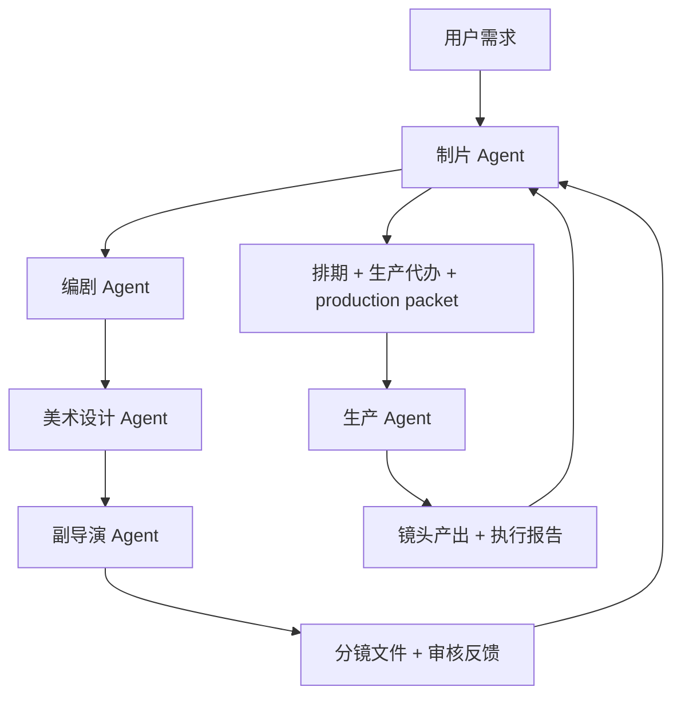

# Agent System Prototype

这份文档把 `video-agent-orchestration` 的核心结构单独拆出来，方便在仓库外引用。

如果你关心“怎么把这套角色从 prompt 变成真 Agent”，继续看 [agent-runtime-architecture.md](agent-runtime-architecture.md)。

## 角色

| 角色 | 负责 | 不负责 |
|---|---|---|
| 制片 | 接需求、分派、排期、整合生产包 | 写故事、做美术、拆镜头、跑模型 |
| 编剧 | 故事、创意、剧本包 | 具体视觉方案、镜头排法 |
| 美术设计 | 风格、角色、服化道、风格提示词 | 剧情推进、镜头顺序 |
| 副导演 | 分镜文件、审核反馈 | 排期、模型执行 |
| 生产 | 调模型、生成镜头、记录产出 | 改故事、改风格、改分镜逻辑 |

## 流程

## 能力映射

| 外部能力来源 | 融合到的角色 | 作用 |
|---|---|---|
| `Slate screenplay-development` | 编剧 | 一句话故事闸门、输入路由、开发顺序、结构压力测试 |
| `Slate character-prompt-engine` | 美术设计 | 角色一致性锚点、任务模式、提示词优先级、模型适配思路 |

## 核心原则

- 制片永远是入口和回收口。
- 编剧先提供故事基础。
- 美术设计建立风格和角色前期。
- 副导演既拆分镜，也负责审核反馈。
- 生产 Agent 只在 `production packet` 完整时开工。
