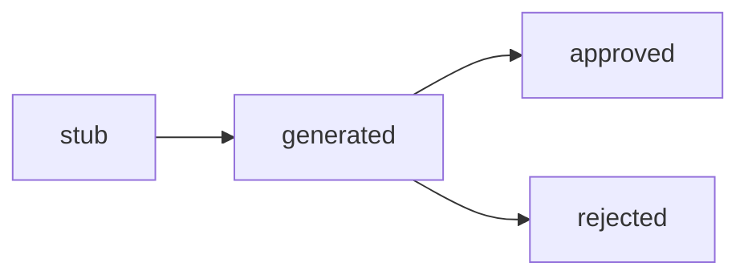

# AssetLibrary

`AssetLibrary` 是 Slate v0.3 的中枢。

它统一管理 5 种资产：

- `character`
- `location`
- `prop`
- `style_pack`
- `camera_pack`

## 磁盘布局

```text
<root>/
  character/
    luban/
      meta.yaml
      luban-001.png
  location/
    zhaozhou-bridge/
      meta.yaml
      bridge-001.png
  style_pack/
    2d-guofeng/
      meta.yaml
```

`meta.yaml` 至少包含：

- `asset_id`
- `asset_type`
- `name`
- `aliases`
- `description`
- `visual_hooks`
- `reference_image_paths`
- `status`
- `created_by_phase`
- `created_by_agent`
- `notes`

## 五种 asset_type 的使用场景

### `character`

人物身份资产。用于把名字映射到一套稳定的视觉参考。

### `location`

场景资产。用于桥、城、室内空间这类需要跨镜稳定复现的地点。

### `prop`

道具资产。用于剑、车、纸鹤、褡裢这类识别物件。

### `style_pack`

风格基准资产。描述的是渲染逻辑，不是一个具体物体。

### `camera_pack`

相机 / 摄影预设资产。Slate v0.3 只保留接口，不由 `character-prompt-engine` 处理。

## 生命周期



负责方：

- 制片：创建 `stub`
- 图片生产：生成参考图并翻到 `generated`
- 副导演 / 制片审核：决定 `approved` 或 `rejected`

## `resolve_name`

`AssetLibrary.resolve_name(text)` 会扫描名字和 alias，在文本里找命中的资产。

用途：

- `compile_shot` 里把名字解析成资产
- `feedback.parse_feedback` 里把评论指向具体 asset

## 设计边界

v0.3 的 `AssetLibrary` 只做：

- 磁盘存储
- 名称 / alias 解析
- 状态流转

它**不做**：

- 数据库
- 向量检索
- 跨项目复用
