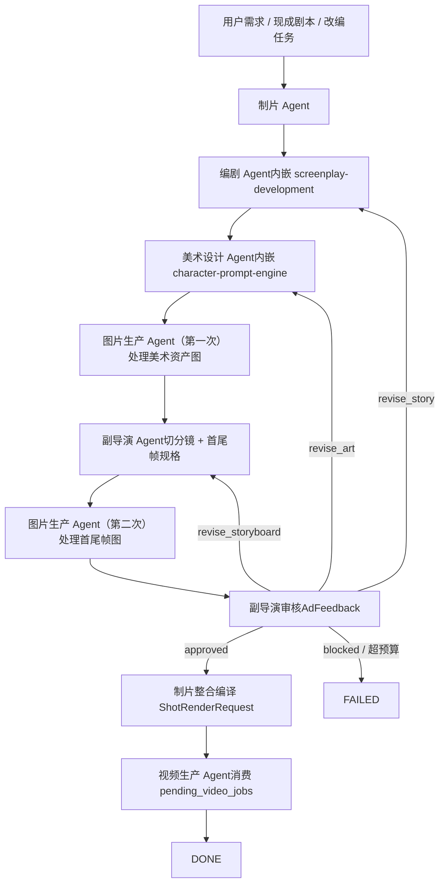

# Slate 主控 / Video Agent Orchestration

## 定位

这是 `Slate` 的主控 skill，不是单个文档生成器。

它的任务是把一个视频项目前期从“模糊材料”推进到“结构化 `ShotRenderRequest[]` 已准备好进入模型执行层”的状态。

它会在中途显式调用：

- `Use $screenplay-development`：编剧阶段
- `Use $character-prompt-engine`：美术设计阶段

## 六角色分工

| 角色 | 主要工作 | 不负责 | 关键输出 |
|---|---|---|---|
| 制片 Agent | 冻结 brief、建 stub assets、分派、整合、控制 revision budget | 写故事、出图、跑视频模型 | `ProjectBrief`、stub `Asset[]`、`ProductionPacket` |
| 编剧 Agent | 故事改编、结构整理、角色卡登记 | 美术、镜头、跑模型 | `StoryPackage` |
| 美术设计 Agent | 视觉方向、角色 / 场景 / 道具 / style pack 设计，产出 `ImageJob[]` | 真正出图、改故事 | `ArtGenerationPlan` |
| 图片生产 Agent | 消费 `pending_image_jobs`，产出资产图和首尾帧图 | 改故事、改风格、改分镜 | 回写 `AssetLibrary`、`FrameRef.image_path` |
| 副导演 Agent | 切分镜、标运镜 / 景别 / 机位、指定首尾帧规格、审核 | 真正出图、跑视频模型 | `StoryboardPackage`、新的 `ImageJob[]`、`AdFeedback` |
| 视频生产 Agent | 消费 `pending_video_jobs`，调下游视频模型 | 改前面任何东西 | 视频产出路径、执行报告 |

## 流程图



## 入口路由

先判断当前入口属于哪一类：

- `NEW_BRIEF`
  - 从 `制片 Agent` 开始
  - 冻结 `ProjectBrief`
  - 进入编剧
- `EXISTING_SCRIPT`
  - 从 `编剧 Agent` 开始
  - 不重写项目，不重开 premise
  - 目标是把既有剧本整理成 `StoryPackage`
- `ADAPTATION`
  - 从 `编剧 Agent` 开始
  - 先做改编策略，再落 `StoryPackage`
- `PRODUCTION_RESCUE`
  - 从当前最缺的那一段开始
  - 如果故事松散，从编剧重进
  - 如果故事已稳但视觉不可执行，从美术重进
  - 如果故事 / 美术都在，但镜头规格和首尾帧没法生产，从副导演重进

## AssetLibrary lifecycle

`AssetLibrary` 是整个插件的中枢。

状态流转：

- `stub`
  - 由制片在编剧完成后创建
  - 来源：`StoryPackage.characters` + 场景 / 道具 / style pack 需求
- `generated`
  - 由图片生产 Agent 在消费 `pending_image_jobs` 后回写
  - 表示 asset 已经有参考图
- `approved`
  - 由副导演审核通过后视为可进入下游生产

谁负责翻状态：

- 制片：建 stub
- 图片生产：`stub -> generated`
- 副导演审核通过：`generated -> approved`

## 与其他 skill 的关系

### 编剧阶段

固定调用：

```text
Use $screenplay-development
```

目标不是产出文学文本，而是填满 `runtime/video_agents/schemas.py` 里的 `StoryPackage`。

### 美术阶段

固定调用：

```text
Use $character-prompt-engine
```

目标不是把 prompt 给人复制，而是把 prompt 写进 `ArtGenerationPlan.asset_jobs[*].prompt`。

## 与 Python runtime 的关系

阶段和 schema 对应如下：

| 阶段 | 结构化产物 | 代码位置 |
|---|---|---|
| 制片 intake | `ProjectBrief` | `runtime/video_agents/schemas.py` |
| 编剧 | `StoryPackage` | `runtime/video_agents/schemas.py` |
| 美术设计 | `ArtGenerationPlan` | `runtime/video_agents/schemas.py` |
| 副导演切分镜 | `StoryboardPackage` + `ImageJob[]` | `runtime/video_agents/schemas.py` |
| 副导演审核 | `AdFeedback` | `runtime/video_agents/schemas.py` |
| 制片整合 | `ProductionPacket` + `ShotRenderRequest[]` | `runtime/video_agents/schemas.py` |

如果当前工作不能映射回这些 schema，就说明还没到可交接状态。

## handoff 规则

每阶段至少要交一份“给人看”的文档和一份“给 runtime 吃”的结构：

- 制片 -> 编剧
  - `brief.md`
  - `ProjectBrief`
- 编剧 -> 制片 / 美术
  - `story_package.md`
  - `StoryPackage`
- 制片 -> 美术
  - `AssetLibrary` stub assets
- 美术 -> 图片生产
  - `art_package.md`
  - `ArtGenerationPlan`
- 图片生产 -> 副导演
  - 已回写的 `AssetLibrary`
  - `pending_image_jobs` 为空
- 副导演 -> 图片生产
  - `storyboard.md`
  - `StoryboardPackage`
  - 新的 `ImageJob[]`（首尾帧）
- 副导演审核 -> 制片
  - `ad_feedback.md`
  - `AdFeedback`
- 制片整合 -> 视频生产
  - `production_packet.md`
  - `ProductionPacket`
  - `pending_video_jobs`

打回权：

- 副导演可打回编剧 / 美术 / 自己
- 制片可因 scope、预算、交付不完整而 fail closed
- 图片生产失败 2 次属于 blocking issue，不默默跳过

## 视觉 hook guardrail

- 如果 brief 或 `StoryPackage` 的卖点依赖 `反差`、`好笑`、`一眼识别`、literal reveal 或 visual gag，美术阶段不能为了“高级感”把它弱化成模糊氛围。
- 只要 concept 依赖变形、身份 reveal 或笑点触发，美术必须明确写出 `literal` / `semi-literal` / `metaphorical`。
- 副导演必须对照 brief promise 和 art execution 做 first-watch readability 检查；识别度掉了，就应该打回，不做“软提醒后放行”。

## 阶段门

- `pending_image_jobs` 未空，不得进入副导演阶段
- 副导演未给出 `StoryboardPackage`，不得进入图片生产第二次
- `production_packet` 未完整，不得进入视频生产
- `ShotRenderRequest[]` 未编译完成，不算项目 ready

## revision budget

- 编剧：`2`
- 美术：`2`
- 副导演：`1`
- 总数：`5`

超过预算，直接 `FAILED`，不继续循环。

## 交付检查

进入下一阶段前，主控 skill 要问：

1. 这个阶段的 schema 有没有填满
2. handoff 所需文件有没有齐
3. 下游是不是还需要猜
4. 若下游还要猜，是故事问题、美术问题，还是分镜问题

## references

先读：

- [references/pipeline-files.md](references/pipeline-files.md)
- [references/handoff-rules.md](references/handoff-rules.md)

## 典型会话示例

一个 2D 动画改编从头到尾的典型流：

1. 用户说：`把赵州桥故事做成 2D 国风动画前期生产包`
2. 制片冻结 `ProjectBrief`
3. 编剧阶段调用 `Use $screenplay-development`，产出 `StoryPackage`
4. 制片根据 `StoryPackage.characters` 和场景需求建 stub `Asset[]`
5. 美术阶段调用 `Use $character-prompt-engine`，产出 `ArtGenerationPlan.asset_jobs`
6. 图片生产 Agent 第一次消费 `pending_image_jobs`，回写 `AssetLibrary`
7. 副导演切分 `StoryboardPackage`，同时产出首尾帧 `ImageJob[]`
8. 图片生产 Agent 第二次消费首尾帧任务
9. 副导演审核，输出 `AdFeedback`
10. 如果 `approved`，制片整合并编译 `ShotRenderRequest[]`
11. 视频生产 Agent 消费 `pending_video_jobs`
12. 项目进入 `DONE`
